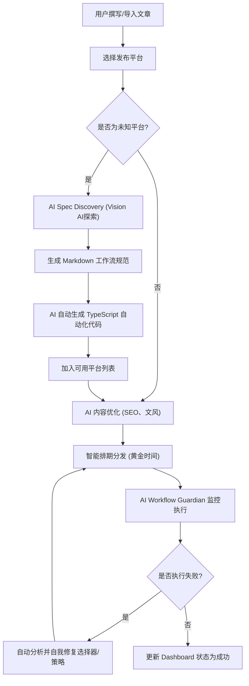

## 1. 产品概述
ArtiPub AI 是一款由AI驱动的内容多平台智能分发系统，帮助创作者实现一键多平台发布。
- 本系统通过AI大模型（如OpenAI/Claude）与计算机视觉技术，彻底解决了传统爬虫脆弱易失效的问题。AI Agent 能够自动探索目标平台的网页结构并生成发布流程，支持跨平台的内容智能优化、自动排期与监控。

## 2. 核心功能

### 2.1 用户角色
| 角色 | 注册方式 | 核心权限 |
|------|---------------------|------------------|
| 创作者 | 邮箱或本地账号登录 | 创作内容、配置平台、执行AI分发任务、管理工作流 |

### 2.2 功能模块
1. **控制台 (Dashboard)**：发布状态、任务进度监控、数据统计仪表盘。
2. **创作与发布 (Editor)**：Markdown编辑器、多平台勾选、AI内容优化（SEO、文风适配）。
3. **平台与工作流管理 (Platforms & Workflows)**：平台账号状态、AI Spec Discovery自动探索新平台、工作流守护与日志。
4. **设置 (Settings)**：AI API Key配置（OpenAI/Anthropic）。

### 2.3 页面详情
| 页面名称 | 模块名称 | 功能描述 |
|-----------|-------------|---------------------|
| 控制台 | 仪表盘 | 实时追踪各平台的发布状态、进度、历史记录及互动率“黄金时间”推荐。 |
| 创作页 | Markdown编辑器 | 支持Markdown写作或导入内容，提供AI智能优化按钮自动调整各平台文风。 |
| 平台管理 | 平台列表 | 预置支持知乎、掘金、CSDN等平台。支持调用AI Spec Discovery探索未知新平台。 |
| 工作流详情 | 规范与日志 | 展示生成的 Markdown 工作流规范（docs/workflow/），以及 AI Workflow Guardian 的自我修复日志。 |

## 3. 核心流程
核心发布与自适应流程：

## 4. 用户界面设计
### 4.1 设计风格
- **整体基调**：极简现代、科技感、AI智能感，类似 Vercel/Linear 的设计风格。
- **主题色彩**：全面适配暗黑模式（Dark Mode），深色背景配合霓虹/紫蓝色的 AI 亮色点缀，凸显智能特性。
- **布局风格**：侧边栏导航 + 顶部操作栏 + 主内容区的经典 SaaS 布局（基于 shadcn/ui 的卡片式设计）。
- **字体规范**：系统默认无衬线字体（Inter），代码和 Markdown 部分使用等宽字体（JetBrains Mono 或 Fira Code）。

### 4.2 页面设计概览
| 页面名称 | 模块名称 | UI 元素 |
|-----------|-------------|-------------|
| 控制台 | 状态概览 | 渐变发光卡片、进度条、发布成功率环形图、最近活动列表。 |
| 创作页 | 编辑区域 | 沉浸式双栏 Markdown 编辑与预览，悬浮的 AI Sparkle 图标按钮用于唤起优化。 |
| 平台管理 | 列表与探索 | 网格布局的平台卡片，包含平台Logo、状态标签。顶部有抢眼的“AI 探索新平台”输入框与发光按钮。 |

### 4.3 响应式设计
- 优先适配桌面端（宽屏分发工作台），自适应移动端布局（侧边栏折叠为汉堡菜单，卡片单列堆叠），支持触摸交互优化。
