## 1. 架构设计

```mermaid
graph TD
    subgraph "前端 (Next.js App Router)"
        UI["UI 层 (React, Tailwind, shadcn/ui)"]
        State["状态管理 (React Hooks/Zustand)"]
    end
    
    subgraph "AI 核心模块 (Server Actions/API)"
        SDK["Vercel AI SDK"]
        Discovery["AI Spec Discovery (Vision AI)"]
        Gen["AI Code Generation"]
        Opt["AI 内容优化引擎"]
    end
    
    subgraph "自动化与工作流 (Node端)"
        Spec["Markdown Workflow Specification"]
        Guardian["AI Workflow Guardian (监控与修复)"]
        Puppeteer["无头浏览器/Playwright执行引擎"]
    end
    
    UI <--> State
    State <--> SDK
    SDK <--> Discovery
    SDK <--> Gen
    SDK <--> Opt
    Discovery --> Spec
    Spec --> Gen
    Gen --> Guardian
    Guardian --> Puppeteer
```


## 2. 技术说明
- **前端框架**: Next.js 15 (App Router), React 18, TypeScript
- **样式与组件**: Tailwind CSS v3, shadcn/ui, Lucide Icons, next-themes (暗黑模式)
- **AI 集成**: Vercel AI SDK (`ai`, `@ai-sdk/openai`, `@ai-sdk/anthropic`)
- **工作流与文件系统**: Node.js `fs/promises` 操作 `docs/workflow/` 目录
- **网页自动化执行**: 采用基于无头浏览器的代理脚本架构 (Playwright 或 Puppeteer，用于后台静默执行和探索)
- **Markdown 处理**: `react-markdown`, `remark-gfm`

## 3. 路由定义
| 路由 | 目标 |
|-------|---------|
| `/` | Dashboard，展示发布统计与近期任务 |
| `/editor` | 文章创作、AI优化与多平台发布入口 |
| `/platforms` | 平台管理、AI Spec Discovery 探索新平台 |
| `/workflows` | 查看 Markdown 工作流规范与日志 |
| `/settings` | 系统设置与 AI 模型 API 密钥配置 |

## 4. API / Server Actions 定义
```typescript
// 触发 AI Spec Discovery 探索新平台
export async function discoverPlatform(url: string, useVision: boolean): Promise<DiscoveryResult>;

// AI 内容优化
export async function optimizeContent(content: string, platformId: string): Promise<string>;

// 读取/写入 Markdown 工作流规范
export async function saveWorkflowSpec(platformId: string, specMarkdown: string): Promise<void>;

// 触发 AI Workflow Guardian 修复工作流
export async function autoFixWorkflow(platformId: string, errorLog: string): Promise<FixResult>;
```

## 5. 数据模型
本地桌面端或自托管工具架构，数据主要依赖本地 JSON 配置文件或文件系统存储（如 `docs/workflow/*.md`）。

### 5.1 工作流文件结构定义
```text
/docs
  /workflow
    ├── zhihu.md
    ├── juejin.md
    └── [new-platform].md
```
